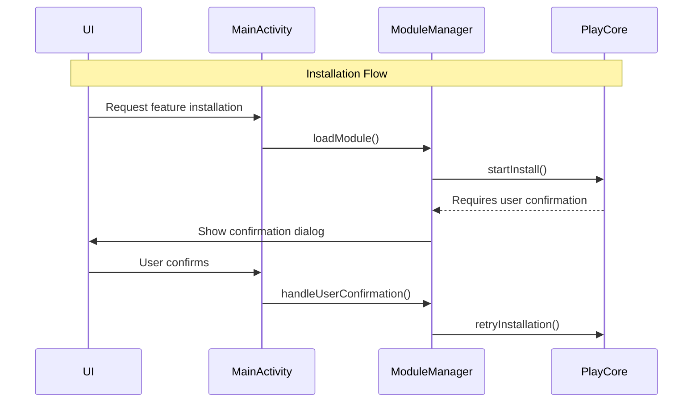

# Dynamic Feature Management System

A robust dynamic feature management solution for Android applications that enables on-demand loading of feature modules. This system follows clean architecture principles and provides a clean API for feature management.

## Architecture Overview

### Core Components

#### 1. ModuleManager Interface
```kotlin
interface ModuleManager {
    fun isModuleInstalled(moduleName: String): Boolean
    fun getModuleState(moduleName: String): Flow<ModuleState>
    suspend fun loadModule(moduleName: String)
    fun retryModuleLoad(moduleName: String)
    fun handleUserConfirmation(moduleName: String)
    fun setConfirmationLauncher(launcher: ActivityResultLauncher<IntentSenderRequest>)
    fun setActivity(activity: Activity?)
    fun cleanup()
}
```
- Defines the contract for feature module management
- Provides reactive state management through Kotlin Flow
- Handles module installation, confirmation, and cleanup

#### 2. Module States
```kotlin
sealed class ModuleState {
    object NotLoaded : ModuleState()
    object Loading : ModuleState()
    data class LoadingProgress(val progress: Float) : ModuleState()
    object Loaded : ModuleState()
    data class NeedsConfirmation(val confirmationCallback: () -> Unit) : ModuleState()
    data class Error(val message: String) : ModuleState()
}
```
- Represents all possible states of a feature module
- Provides type-safe state handling
- Includes progress tracking and error states

#### 3. DynamicFeatureManager Implementation
```kotlin
internal class DynamicFeatureManager private constructor(
    private val application: Application
) : ModuleManager
```
- Singleton implementation of ModuleManager
- Handles Play Core integration
- Manages installation sessions and state updates

### Key Features

#### Session Management
- Tracks installation sessions
- Handles session cleanup
- Maps session IDs to module names

#### State Management
- Uses MutableStateFlow for reactive updates
- Provides thread-safe state updates
- Handles state transitions

#### Error Handling
- Comprehensive error states
- Detailed error messages
- Retry mechanisms

#### Compatibility Checking
- Device compatibility verification
- SDK version validation
- Network availability checks

### Architecture Patterns

#### 1. Singleton Pattern
- Used in DynamicFeatureManager
- Ensures single instance across app
- Thread-safe initialization

#### 2. Observer Pattern
- Implemented through Kotlin Flow
- Reactive state updates
- UI state synchronization

#### 3. Factory Pattern
- ModuleManagerProvider for instance creation
- Encapsulates implementation details
- Provides dependency injection

#### 4. State Pattern
- Sealed classes for state management
- Type-safe state transitions
- Clear state boundaries

### Security Considerations

#### 1. Activity Context Management
- Proper activity lifecycle handling
- Memory leak prevention
- Context cleanup

#### 2. Permission Handling
- Network permission checks
- Storage permission management
- Runtime permission requests

### Best Practices

#### 1. Logging
- Comprehensive logging system
- Debug and error tracking
- Installation progress monitoring

#### 2. Resource Management
- Proper cleanup of resources
- Memory management
- Session cleanup

#### 3. Thread Safety
- Mutex for critical sections
- Coroutine scope management
- Background task handling

## System Flow

### Sequence Diagram

```mermaid
sequenceDiagram
    participant MainActivity
    participant ModuleManager
    participant DynamicFeatureManager
    participant PlayCore
    participant UI

    Note over MainActivity,UI: Initialization Phase
    MainActivity->>ModuleManager: getInstance(application)
    ModuleManager->>DynamicFeatureManager: create instance
    MainActivity->>ModuleManager: setActivity(activity)
    MainActivity->>ModuleManager: setConfirmationLauncher(launcher)

    Note over MainActivity,UI: Module Installation Flow
    UI->>MainActivity: User requests feature
    MainActivity->>ModuleManager: loadModule(moduleName)
    
    rect rgb(200, 220, 255)
        Note over ModuleManager: Pre-installation Checks
        ModuleManager->>ModuleManager: isModuleInstalled()
        alt Module already installed
            ModuleManager-->>UI: ModuleState.Loaded
            return
        end
        
        ModuleManager->>ModuleManager: isModuleCompatible()
        alt Not compatible
            ModuleManager-->>UI: ModuleState.Error
            return
        end
        
        ModuleManager->>ModuleManager: isPlayStoreAvailable()
        alt Play Store not available
            ModuleManager-->>UI: ModuleState.Error
            return
        end
        
        ModuleManager->>ModuleManager: retryWithBackoff()
        alt No network
            ModuleManager-->>UI: ModuleState.Error
            return
        end
    end

    rect rgb(220, 255, 220)
        Note over ModuleManager: Installation Process
        ModuleManager->>PlayCore: startInstall(request)
        PlayCore-->>ModuleManager: sessionId
        
        loop Installation Progress
            PlayCore->>ModuleManager: state updates
            ModuleManager->>UI: ModuleState.LoadingProgress
        end
        
        alt Installation Success
            PlayCore->>ModuleManager: INSTALLED
            ModuleManager->>UI: ModuleState.Loaded
        else Installation Failed
            PlayCore->>ModuleManager: FAILED
            ModuleManager->>UI: ModuleState.Error
        end
    end

    rect rgb(255, 220, 220)
        Note over ModuleManager: Error Handling
        alt ACCESS_DENIED
            PlayCore->>ModuleManager: Error(-7)
            ModuleManager->>PlayCore: deferredInstall()
            ModuleManager->>UI: ModuleState.NeedsConfirmation
            UI->>ModuleManager: handleUserConfirmation()
            ModuleManager->>PlayCore: retryInstallation()
        end
    end

    Note over MainActivity,UI: Cleanup
    MainActivity->>ModuleManager: cleanup()
    ModuleManager->>PlayCore: unregisterListener()
```

### Flow Description

1. **Initialization Phase**
   - ModuleManager instance creation
   - Activity and launcher setup
   - Initial state configuration

2. **Pre-installation Checks**
   - Module installation status verification
   - Compatibility checks
   - Play Store availability
   - Network connectivity validation

3. **Installation Process**
   - Installation request initiation
   - Progress tracking
   - Success/failure handling
   - State updates to UI

4. **Error Handling**
   - ACCESS_DENIED scenario management
   - Deferred installation handling
   - User confirmation flow
   - Error state propagation

5. **Cleanup**
   - Resource cleanup
   - Listener unregistration
   - State reset

## Usage Example

```kotlin
// Initialize
val moduleManager = ModuleManagerProvider.getInstance(application)
moduleManager.setActivity(activity)

// Load module
scope.launch {
    moduleManager.loadModule("feature_name")
}

// Observe state
moduleManager.getModuleState("feature_name")
    .collect { state ->
        when (state) {
            is ModuleState.Loaded -> // Handle loaded state
            is ModuleState.Loading -> // Handle loading state
            is ModuleState.Error -> // Handle error state
        }
    }
```

## ActivityResultLauncher Implementation

### Overview
The system uses `ActivityResultLauncher<IntentSenderRequest>` to handle Play Store's installation confirmation dialogs in a modern, type-safe way.

### Purpose
```kotlin
private lateinit var confirmationLauncher: ActivityResultLauncher<IntentSenderRequest>
```
- Part of the modern Android Activity Result API
- Handles the result of an activity started for a result
- Provides type-safe way to handle activity results

### Implementation Details

#### 1. Launcher Registration
```kotlin
confirmationLauncher = registerForActivityResult(
    ActivityResultContracts.StartIntentSenderForResult()
) { result ->
    if (result.resultCode == Activity.RESULT_OK) {
        moduleManager.handleUserConfirmation(PLANTS_MODULE)
    }
}
```

#### 2. Usage in ModuleManager
```kotlin
ModuleState.NeedsConfirmation {
    installationState.state.resolutionIntent()?.let {
        confirmationLauncher?.launch(
            IntentSenderRequest.Builder(it.intentSender)
                .build()
        )
    }
}
```

### Key Benefits

1. **Type Safety**
   - Compile-time checking of result handling
   - Prevents runtime errors
   - Better IDE support

2. **Lifecycle Awareness**
   - Automatically handles activity recreation
   - No manual state saving needed
   - Handles configuration changes

3. **Memory Safety**
   - No memory leaks from static callbacks
   - Proper cleanup on activity destruction
   - Better resource management

4. **Modern API Integration**
   - Part of the new Activity Result API
   - Better integration with modern Android architecture
   - Follows latest best practices

### Flow Example



### Error Handling

```kotlin
confirmationLauncher = registerForActivityResult(
    ActivityResultContracts.StartIntentSenderForResult()
) { result ->
    when (result.resultCode) {
        Activity.RESULT_OK -> {
            // User confirmed installation
            moduleManager.handleUserConfirmation(PLANTS_MODULE)
        }
        Activity.RESULT_CANCELED -> {
            // User cancelled installation
            // Handle cancellation
        }
        else -> {
            // Handle other results
        }
    }
}
```

### Integration with Play Core

```kotlin
// Play Core provides the IntentSender
val resolutionIntent = installationState.state.resolutionIntent()
if (resolutionIntent != null) {
    // Launch the confirmation dialog
    confirmationLauncher?.launch(
        IntentSenderRequest.Builder(resolutionIntent.intentSender)
            .build()
    )
}
```

### Why Not Deprecated Methods?

1. **Modern API Benefits**
   - Replaces older `startActivityForResult()`
   - More robust handling of configuration changes
   - Better integration with modern Android architecture

2. **Improved Developer Experience**
   - Type-safe result handling
   - Better IDE support
   - Clearer code structure

3. **Better Error Prevention**
   - Compile-time checking
   - Runtime safety
   - Memory leak prevention

## Future Improvements

1. **Caching**
   - Module state persistence
   - Offline support
   - Installation progress caching

2. **Analytics**
   - Installation success rates
   - Error tracking
   - Usage statistics

3. **Performance**
   - Parallel module loading
   - Background installation
   - Resource optimization

4. **Testing**
   - Unit test coverage
   - Integration tests
   - UI tests
